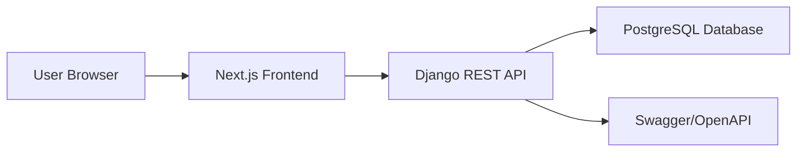
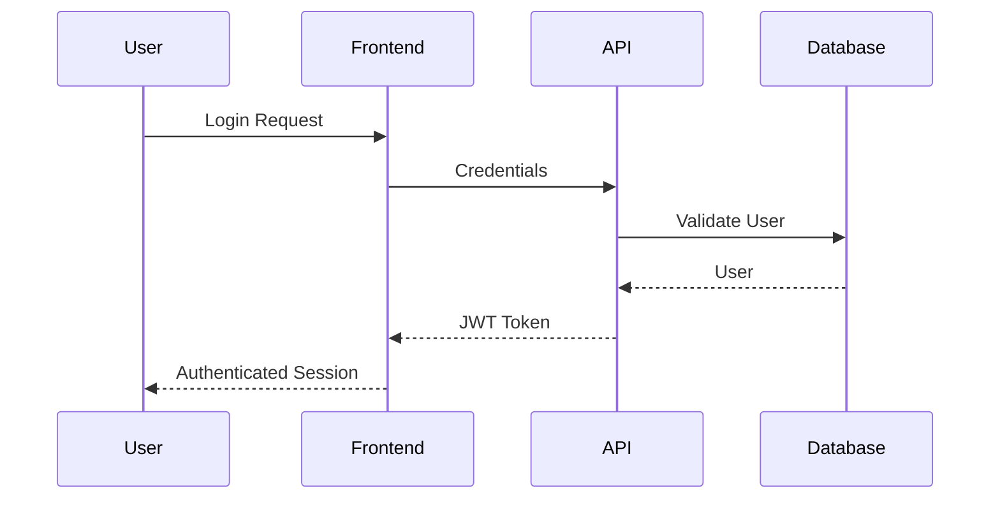
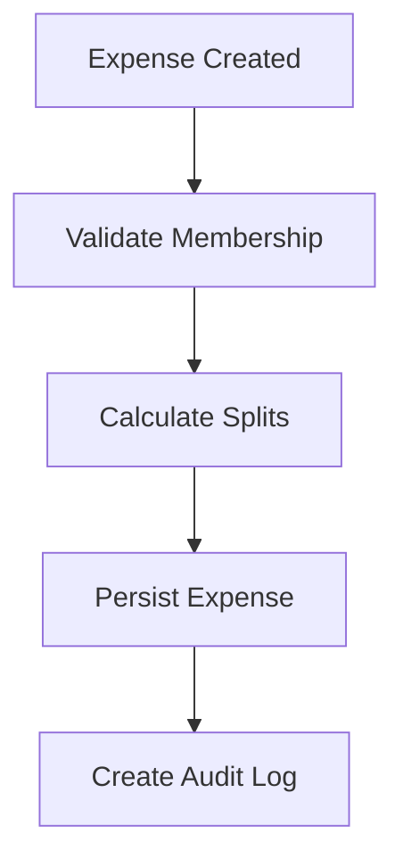
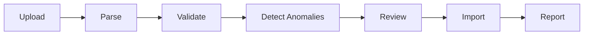

# ARCHITECTURE.md

# System Overview

The Shared Expenses Application is designed as a modern client-server web application with a clear separation between presentation, business logic, and data persistence.

The architecture prioritizes:

* Auditability
* Explainability
* Maintainability
* Extensibility
* Deterministic financial calculations

The system is designed around the assignment's core challenge of handling imperfect financial data while preserving transparency.

---

# High-Level Architecture



---

# Technology Choices

## Frontend

### Next.js

Chosen because it provides:

* Modern React architecture
* Routing
* TypeScript support
* Strong developer experience
* Easy deployment on Vercel

---

## Backend

### Django + Django REST Framework

Chosen because it provides:

* Mature ORM
* Strong validation support
* Rapid API development
* Authentication support
* Excellent PostgreSQL integration

---

## Database

### PostgreSQL

Chosen because:

* Assignment requires a relational database
* Strong transaction guarantees
* Referential integrity
* Mature ecosystem
* Excellent support for financial systems

---

# Layered Architecture

The backend follows a layered structure.

```text
Presentation Layer
       ↓
API Layer
       ↓
Service Layer
       ↓
Data Layer
```

---

## Presentation Layer

Implemented using:

* Next.js
* React
* Tailwind CSS

Responsibilities:

* User interface
* Forms
* Dashboard rendering
* Import review workflow

---

## API Layer

Implemented using:

* Django REST Framework

Responsibilities:

* Request validation
* Authentication
* Serialization
* Response formatting

---

## Service Layer

Responsibilities:

* Balance calculation
* Debt simplification
* Import processing
* Anomaly detection
* Membership validation

This layer contains the primary business rules.

---

## Data Layer

Implemented using:

* Django ORM
* PostgreSQL

Responsibilities:

* Persistence
* Transactions
* Query execution

---

# Backend Module Architecture

## Accounts Module

Responsibilities:

* User registration
* Login
* JWT issuance
* Google authentication support

Primary entities:

* User

---

## Groups Module

Responsibilities:

* Group creation
* Group management
* Currency management
* Membership history

Primary entities:

* Group
* GroupMembership
* Currency

---

## Expenses Module

Responsibilities:

* Expense management
* Split calculations
* Expense history
* Balance generation

Primary entities:

* Expense
* ExpenseParticipant
* ExpenseHistory

---

## Settlements Module

Responsibilities:

* Payment recording
* Debt reduction

Primary entities:

* Settlement

---

## Imports Module

Responsibilities:

* CSV upload
* CSV parsing
* Validation
* Anomaly detection
* Import execution
* Import reports

Primary entities:

* ImportSession
* ImportAnomaly

---

## Audit Module

Responsibilities:

* Audit logging
* Activity tracking

Primary entities:

* AuditLog

---

## Reports Module

Responsibilities:

* Summary reporting
* Category reporting
* Spending insights

---

# Authentication Flow



Authentication uses JWT tokens for stateless API access.

---

# Membership Timeline Architecture

A major assignment requirement is support for changing group membership.

Each membership record contains:

* joined_at
* left_at

Example:

```text
Meera
Joined: February 1
Left: March 31

Sam
Joined: April 15
Left: NULL
```

This design allows historical calculations to remain accurate.

---

# Expense Processing Flow



Before an expense is stored:

1. Membership is validated.
2. Split values are validated.
3. Currency information is validated.
4. Audit records are created.

---

# Balance Calculation Architecture

Balances are not stored as mutable totals.

Instead, they are derived from source transactions.

Calculation inputs:

* Expenses
* Expense participants
* Settlements
* Membership timelines
* Currency conversion rules

Calculation outputs:

* Net balances
* Debt simplification
* Trace records

This approach improves:

* Auditability
* Explainability
* Data integrity

---

# Currency Handling

The application supports multiple currencies.

Each expense stores:

* Original amount
* Original currency
* Exchange rate
* Converted amount

Balances are calculated using the group currency while preserving source values for auditing.

---

# Import Architecture

The import system follows a review-first design.



The importer never silently changes data.

Users must explicitly approve anomaly resolutions.

---

# Anomaly Detection Framework

The importer uses pluggable anomaly detectors.

Benefits:

* Extensible
* Testable
* Independent rules
* No hardcoded CSV assumptions

Supported anomaly categories include:

* Duplicates
* Membership violations
* Invalid dates
* Invalid amounts
* Currency issues
* Split inconsistencies

---

# Audit Architecture

Every important financial action generates an audit record.

Examples:

* Expense creation
* Expense update
* Expense deletion
* Settlement creation
* Import execution
* Duplicate resolution

Audit logs provide a complete historical record of system activity.

---

# Scalability Considerations

The architecture supports future expansion through:

* Additional split types
* Additional currencies
* New anomaly detectors
* Additional reporting modules
* Alternative authentication providers

The modular backend design minimizes coupling between business domains.

---

# Design Philosophy

The system was designed around three principles:

### Transparency

Every financial calculation should be explainable.

### Auditability

Every significant action should be traceable.

### Data Integrity

Invalid or suspicious data should be surfaced rather than silently modified.

These principles guided all major engineering decisions throughout the project.
