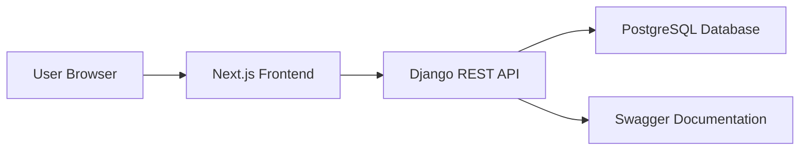
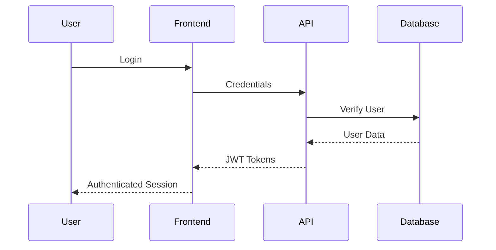
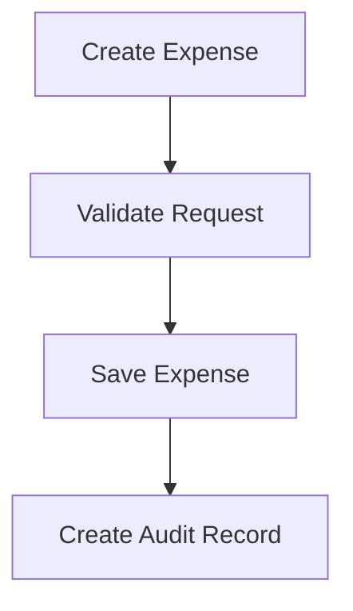
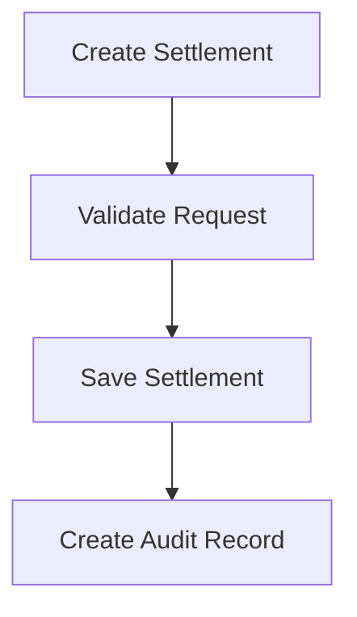
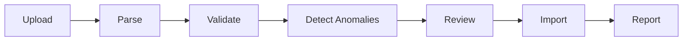

# ARCHITECTURE.md

# System Architecture

The Shared Expenses Application is a full-stack web application built using a modern client-server architecture.

The system separates:

* User Interface
* Business Logic
* Data Persistence

This separation improves maintainability, testability, and scalability.

The application was designed to support:

* Shared expense tracking
* Group management
* Settlement recording
* CSV import workflows
* Anomaly review
* Audit logging

---

# High-Level Architecture



---

# Technology Stack

## Frontend

### Next.js

Responsibilities:

* User Interface
* Routing
* Form Handling
* API Communication
* Import Review Screens

Benefits:

* React-based architecture
* TypeScript support
* Easy deployment
* Fast development workflow

---

## Backend

### Django + Django REST Framework

Responsibilities:

* Authentication
* Business Logic
* Validation
* Data Access
* REST API Endpoints

Benefits:

* Mature ecosystem
* Strong ORM support
* Built-in security features
* Fast API development

---

## Database

### PostgreSQL

Responsibilities:

* Persistent Data Storage
* Transaction Management
* Relationship Management

Benefits:

* ACID compliance
* Strong relational modeling
* Reliable transaction support

---

# Layered Architecture

```text
Frontend Layer
      ↓
REST API Layer
      ↓
Business Logic Layer
      ↓
Database Layer
```

---

# Frontend Layer

Implemented using:

* Next.js
* React
* TypeScript

Responsibilities:

* Authentication screens
* Dashboard pages
* Group management UI
* Expense management UI
* Settlement management UI
* Import workflow UI

---

# API Layer

Implemented using:

* Django REST Framework

Responsibilities:

* Request validation
* Authentication
* Serialization
* Response generation

---

# Business Logic Layer

Responsibilities:

* Expense processing
* Settlement processing
* Group management
* Import processing
* Anomaly detection
* Audit tracking

Business rules are implemented here before data reaches the database.

---

# Database Layer

Implemented using:

* PostgreSQL
* Django ORM

Responsibilities:

* Data persistence
* Query execution
* Transaction safety
* Relationship management

---

# Backend Modules

## Accounts Module

Responsibilities:

* User registration
* User login
* JWT authentication

Primary Entity:

* User

---

## Groups Module

Responsibilities:

* Group creation
* Group updates
* Group membership management

Primary Entities:

* Group
* GroupMembership

---

## Expenses Module

Responsibilities:

* Expense creation
* Expense updates
* Expense deletion
* Balance calculations

Primary Entity:

* Expense

---

## Settlements Module

Responsibilities:

* Settlement recording
* Settlement tracking

Primary Entity:

* Settlement

---

## Imports Module

Responsibilities:

* CSV upload
* CSV parsing
* Validation
* Anomaly detection
* Review workflow
* Import reporting

Primary Entities:

* ImportSession
* ImportAnomaly

---

## Audit Module

Responsibilities:

* Activity tracking
* Change logging

Primary Entity:

* AuditLog

---

## Reports Module

Responsibilities:

* Summary generation
* Reporting endpoints

---

# Authentication Flow



Authentication uses JWT tokens.

Protected API requests include:

```http
Authorization: Bearer <token>
```

---

# Expense Processing Flow



Expense requests are validated before persistence.

Audit records are created for important actions.

---

# Settlement Processing Flow



---

# Import Processing Architecture

The CSV import workflow follows a review-first design.



This approach prevents potentially invalid data from being automatically inserted into the system.

---

# Anomaly Detection

The import system detects issues before records are imported.

Examples:

* Duplicate Records
* Missing Required Fields
* Invalid Amounts
* Invalid Dates
* Membership Violations
* Unknown References

Detected anomalies are surfaced for review.

---

# Audit Architecture

Important actions create audit entries.

Examples:

* Group creation
* Expense creation
* Expense updates
* Settlement creation
* Import execution
* Import review actions

Audit records improve traceability and debugging.

---

# Deployment Architecture

Frontend:

* Vercel

Backend:

* Render

Database:

* PostgreSQL

CI/CD:

* GitHub Actions

---

# Design Principles

The architecture follows three principles:

## Transparency

System actions should be visible and understandable.

## Auditability

Important changes should be traceable.

## Data Integrity

Validation should occur before data is persisted.

These principles guided the overall system design and implementation.
